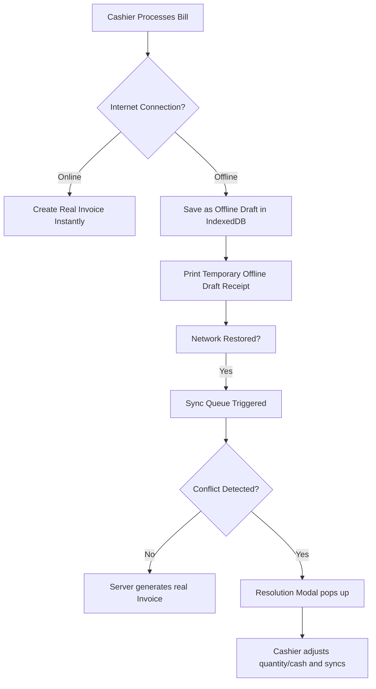

# RestoLedger POS - Production Handover & Shop Setup Manual

> [!SUCCESS]
> Welcome to the production handover manual. This guide will walk you step-by-step through configuring individual shop dashboards, managing staff, utilizing advanced offline billing sync, and successfully handing over the RestoLedger POS SaaS platform.

---

## 📂 Step 1: Accessing the Super-Admin Command Center

The Super-Admin oversees all tenants (shops), governs subscriptions, views platform audit logs, and broadcasts system-wide notifications.

### 🔐 Login Credentials
* **URL:** `/login`
* **Email:** `superadmin@restopos.com`
* **Password:** *[Your Super-Admin Password]*
* **Role:** `super_admin`

### 🛠️ Key Super-Admin Actions
1. **Manage Shops:** Go to **Shops** page. Here you can create a new shop, lock/unlock shop subscriptions, or toggle advanced modules.
2. **System Health:** Monitor server resources, active database metrics, and backup logs.
3. **Announcements Center:** Go to **Announcements** to broadcast real-time neural alerts to cashier dashboards instantly.

---

## 🏪 Step 2: Logging into a Specific Shop's Admin Dashboard

Each shop operates in complete multi-tenant isolation. To manage a specific shop, log in using that shop's dedicated Admin credentials.

### 🔐 Production Shop Admins
* **Shop: Elite Grill House (ID: 3)**
  * **Email:** `nuwan.1778935207491@elitegrill.com`
* **Shop: sehas pathirana (ID: 4)**
  * **Email:** `pathiranasehas676@gmail.com`
* **Shop: sehas pathirana (ID: 6)**
  * **Email:** `pathiranasehas@gmail.com`

---

## ⚙️ Step 3: Setting Up a New Shop Dashboard Step-by-Step

When onboarding a new shop, configure its dashboard sequentially:

### 1. Configure Shop Settings
* Go to **Settings** page.
* **Basic Info:** Set Restaurant Name, phone, and standard tax configurations.
* **Feature Toggles:** Enable or disable **Naya Book**, **Held Bills**, **Quick Retail / No-Bill**, and **Stock Tracking**.

### 2. Configure Offline Mode Settings
Configure how this specific shop handles network connectivity loss:
* Go to **Offline Settings**.
* Set **Manual Conflict Review Required** to `true` (forces cashiers to audit conflicting drafts).
* Set **Allow Price Change Sync** to `true` (accepts offline price adjustments automatically if allowed).
* Set **Max Sync Retry Count** (default `5` attempts).

### 3. Create Staff Accounts (RBAC)
* Go to **Users** management.
* Add your store employees and assign their roles:
  * **Manager:** Full shop permissions except billing settings.
  * **Cashier:** Access to POS terminal, Cash Sales, Held Bills, and Offline Sync Page.
  * **Kitchen:** Kitchen Display System (KDS) access only.

### 4. Seed the Menu (Items)
* Go to **Items** page.
* Add categories (e.g., Beverages, Mains, Desserts).
* Add items with prices, stock quantities, and modifier options (e.g., Small, Large).

### 5. Setup Dining Tables
* Go to **Table Billing** -> Add Tables (e.g., Table 1, Table 2, VIP Room) for dine-in guest tracking.

---

## ⚡ Step 4: Cashier Operations (Live & Offline Sync)

Instruct your cashiers on how to operate under network instability:

### 1. Normal Billing
* Cashier opens **Cash Sale** or **Quick Retail**.
* If connected, invoice is saved on server instantly.

### 2. Offline Mode Billing
* When internet goes down, a yellow **"OFFLINE MODE ACTIVE"** banner appears.
* Cashier continues adding items, inputs cash, and clicks **"Print Draft"**.
* The sale is safely stored in the browser's **IndexedDB** as a draft.

### 3. Syncing & Resolving Conflicts
* When internet is restored, cashier goes to **Offline Drafts Page**.
* Click **"Sync All"**.
* If a conflict occurs (e.g., item price changed or stock ran out while offline), a red **"Conflict Detected"** badge appears.
* Cashier clicks **"Resolve"**, opens the **Resolution Modal**, reviews adjustments (e.g. accepts new price, adjusts cash received), and hits **"Apply & Resync"**.

---

## 🚀 Step 5: Final Production Handover Checklist

Before handing the POS platform to real store cashiers, check:
1. **Server Running:** Ensure PM2 or systemd node service is running `npm run start` in production.
2. **SSL Enabled:** Verify HTTPS is active for service workers (PWA requires secure HTTPS connection to cache).
3. **Database Backups:** Daily automated SQL backups are verified and running.
4. **Offline Database Init:** Verify cashiers open the app once while online to pre-cache the menu catalog.
